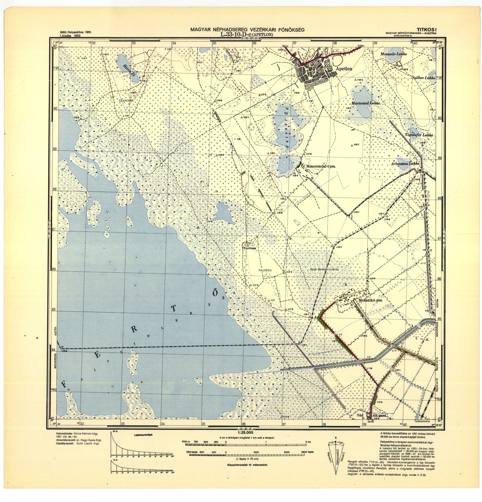
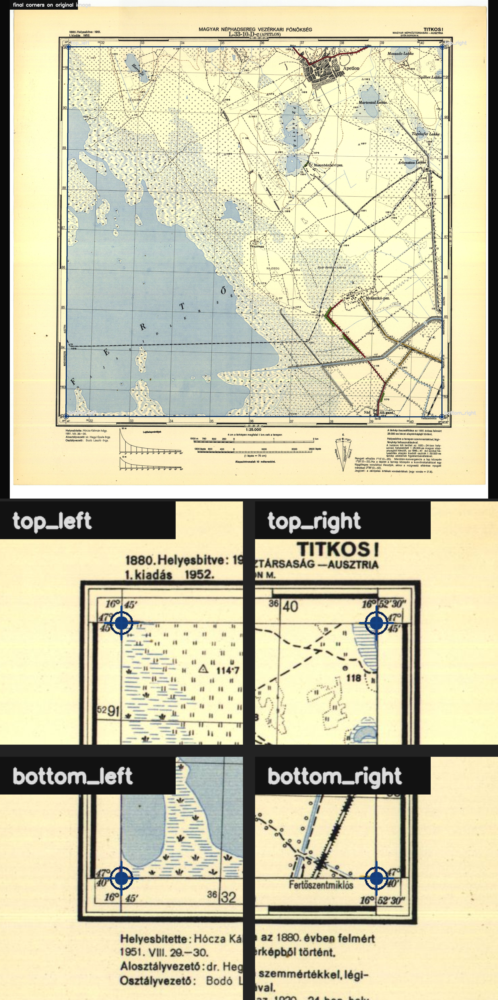
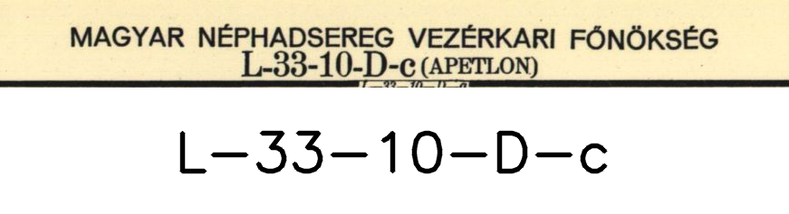

# Map Sheet Corner & OCR Detection

Computer vision project for automatic inner-corner detection and sheet identifier recognition from scanned historical topographic map sheets.

---

# Overview

This project processes scanned 1950s historical map sheets and automatically extracts:

- upper-left corner
- upper-right corner
- lower-right corner
- lower-left corner
- sheet identifier

The pipeline is designed for large-scale batch processing and evaluation on noisy historical scans with varying quality and artifacts.

---

# Features

- automatic inner-corner detection
- automatic sheet identifier recognition
- robust preprocessing for historical scans
- batch image processing
- visualization and debug outputs
- result export pipeline
- scalable evaluation workflow
- robust handling of noise, shadows, and scan artifacts

---

# Technologies

- Python
- OpenCV
- NumPy
- PaddleOCR

---

# Performance

| Metric | Result |
|---|---|
| Corner detection accuracy | ~5 px error for >95% of sheets |
| OCR accuracy | ~95% exact identifier accuracy |

---

# Example Results

## Original Map Sheet



---

## Detected Inner Corners

The system automatically detects the four inner map corners and visualizes them on the original scan.



---

## Detected Sheet Identifier

The OCR pipeline extracts the sheet identifier from the historical map sheet.



---

# Project Structure

```text
project/
│
├── example_result/
│   ├── img.jpg
│   ├── img_corners.jpg
│   └── img_id.jpg
│
├── test_maps/
├── results/
├── map_detector_project/
│
└── README.md
